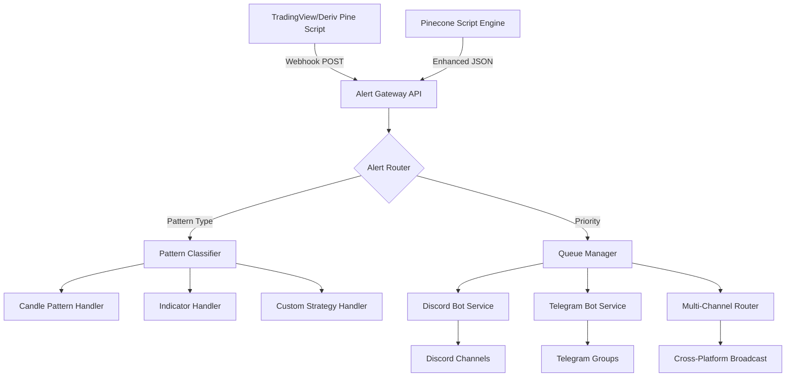

# 🎯 Pinecone Trading Alerts - Advanced Trading Signal System

A comprehensive, production-ready system for receiving real-time trading signals from TradingView and Deriv platforms, processing them through intelligent routing, and delivering actionable alerts to Discord and Telegram via dedicated bots.

---

## 🚀 Advanced Features

- ⏱ **Real-time Processing**: Sub-second alert delivery from signal to notification
- 🕯 **Advanced Pattern Detection**: 15+ candlestick patterns with confidence scoring
- 📊 **Multi-Platform Support**: TradingView + Deriv integration
- 🤖 **Dual Bot Architecture**: Discord + Telegram with intelligent routing
- 🔍 **AI-Powered Classification**: Pattern recognition and signal strength analysis
- 📈 **Rich Formatting**: Interactive charts, emoji indicators, and color-coded signals
- 🔐 **Enterprise Security**: IP whitelisting, signature verification, rate limiting
- 📊 **Comprehensive Monitoring**: Real-time metrics and performance dashboards
- 🐳 **Production-Ready**: Docker, Kubernetes, and CI/CD pipeline support

---

## 🏗️ Advanced Architecture

### 🔄 Data Flow


### 📁 Comprehensive Project Structure

```
pinecone-trading-alerts/
├── 📁 pinecone_scripts/
│   ├── 📁 tradingview/
│   │   ├── 📁 candle_patterns/
│   │   │   ├── engulfing_detector.pine
│   │   │   ├── doji_scanner.pine
│   │   │   ├── hammer_identification.pine
│   │   │   ├── shooting_star.pine
│   │   │   └── morning_evening_star.pine
│   │   ├── 📁 indicators/
│   │   │   ├── rsi_divergence.pine
│   │   │   ├── macd_crossover.pine
│   │   │   ├── bollinger_bands.pine
│   │   │   └── volume_spike.pine
│   │   └── 📁 strategies/
│   │       ├── scalping_strategy.pine
│   │       ├── swing_strategy.pine
│   │       └── breakout_strategy.pine
│   ├── 📁 deriv/
│   │   ├── 📁 synthetic_indices/
│   │   │   ├── volatility_alert.pine
│   │   │   └── jump_index.pine
│   │   └── 📁 forex/
│   │       ├── major_pairs.pine
│   │       └── exotic_pairs.pine
│   └── 📁 shared/
│       ├── alert_templates.pine
│       └── webhook_formatter.pine
├── 📁 alert_engine/
│   ├── 📁 core/
│   ├── 📁 routers/
│   ├── 📁 handlers/
│   └── 📁 config/
├── 📁 bot_services/
│   ├── 📁 discord/
│   ├── 📁 telegram/
│   └── 📁 shared/
├── 📁 api_gateway/
├── 📁 monitoring/
├── 📁 deployment/
├── 📁 tests/
├── 📁 docs/
└── 📁 scripts/
```
## ⚙️ Comprehensive Setup Guide

### 🏁 Quick Start (Development)

```bash
# Clone the repository
git clone https://github.com/your-username/pinecone-trading-alerts.git
cd pinecone-trading-alerts

# Setup development environment
make setup-dev

# Start all services with Docker
make docker-up

# Or run locally
make run-local
```

### 🔧 Manual Setup

#### 1. Environment Configuration
```bash
# Copy environment template
cp .env.example .env

# Edit .env with your credentials
nano .env
```

#### 2. Required Environment Variables
```bash
# Core Configuration
FLASK_ENV=development
SECRET_KEY=your-secret-key-here
REDIS_URL=redis://localhost:6379

# Discord Configuration
DISCORD_BOT_TOKEN=your-discord-bot-token
DISCORD_WEBHOOK_URL=https://discord.com/api/webhooks/YOUR_WEBHOOK_URL
DISCORD_ALERT_CHANNELS=trading-alerts,crypto-signals

# Telegram Configuration
TELEGRAM_BOT_TOKEN=your-telegram-bot-token
TELEGRAM_CHAT_IDS=@your_channel,-1001234567890

# TradingView/Deriv Configuration
TRADINGVIEW_WEBHOOK_SECRET=your-webhook-secret
DERIV_API_KEY=your-deriv-api-key
ALLOWED_IPS=52.89.214.238,34.212.75.30,52.0.0.0/8

# Rate Limiting
RATE_LIMIT_PER_MINUTE=60
BURST_LIMIT=10
QUEUE_TIMEOUT=30
```

#### 3. Pine Script Setup

##### TradingView Setup:
1. Open TradingView → Pine Editor
2. Load scripts from `pinecone_scripts/tradingview/`
3. Set webhook URL: `https://your-server.com/api/v1/webhook/tradingview`
4. Configure alert conditions with JSON payload

##### Deriv Setup:
1. Open Deriv → SmartTrader
2. Load scripts from `pinecone_scripts/deriv/`
3. Set webhook URL: `https://your-server.com/api/v1/webhook/deriv`
4. Configure alert conditions

### 🐳 Docker Deployment

```bash
# Build and start all services
docker-compose up -d

# View logs
docker-compose logs -f

# Scale services
docker-compose up -d --scale discord_bot=3 --scale telegram_bot=2
```

### ☸️ Kubernetes Deployment

```bash
# Deploy to Kubernetes
kubectl apply -f deployment/kubernetes/

# Check deployment status
kubectl get pods -l app=pinecone-alerts
```
🛡 Security
Only accept POST requests from TradingView IPs (optionally validate headers)

Rate-limit incoming alerts

📮 Future Enhancements
UI Dashboard to manage and route alerts

Multiple TradingView account support

Alert batching & scheduling

Auto pattern classification using AI

🙏 Contributions
Pull requests are welcome. For major changes, open an issue first to discuss.


